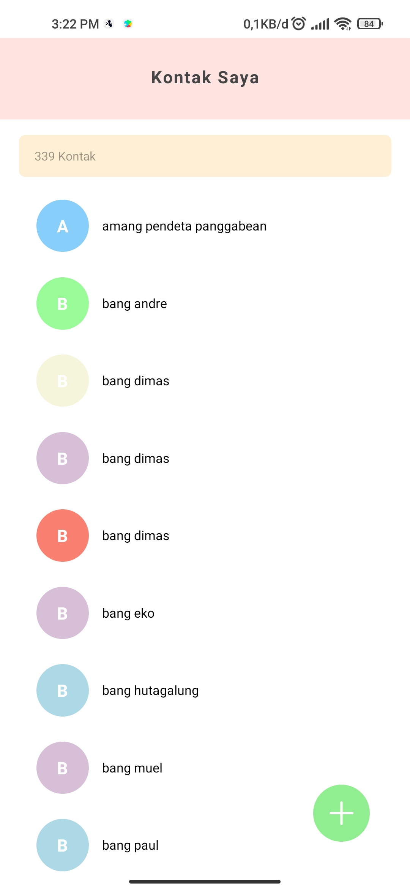

# Tugas4_PAM
Nama Aplikasi : Kontak Saya
Aplikasi ini dibuat dengan react native

  

# Instalasi Aplikasi
1. clone repository dengan kode sebagai berikut:  
    $ git clone https://github.com/nataliasagita/Tugas4_PAM.git
    
2. Install npm di terminal selanjutnya dijalankan perintah sebagai berikut:  
    $ cd Tugas4  
    $ npm start
    
# Deskripsi Aplikasi
aplikasi ini adalah aplikasi kontak saya yang dibuat menggunakan react native dengan bantuan API Contact expo. Aplikasi ini dapat menampilkan nomor telepon yang sudah disimpan. Aplikasi ini juga bisa mencari nama yang ingin dilihat. Aplikasi ini menggunakan bahasa pemprograman Javascript.

# Daftar Package yang digunakan di Aplikasi
Beberapa package yang digunakan pada aplikasi ini :

1. React navigation : <a href="https://reactnavigation.org/"> @react-navigation/native Versi 6.0.10 </a>
2. Stack navigation :<a href="https://reactnavigation.org/docs/hello-react-navigation/"> @react-navigation/native-stack Versi 6.6.2 </a>
3. Expo : <a href="https://docs.expo.dev/"> @expo Versi 44.0.0 </a>
4. React : <a href="https://reactjs.org/"> @React Versi 17.0.1 </a>
5. React Native : <a href="https://reactnative.dev/">  @react-native Versi 0.64.3 </a>
6. Expo Contact Api : <a href="https://docs.expo.dev/versions/v44.0.0/sdk/contacts/"> @expo-contacts Versi 10.1.0 </a>
7. Expo Icon : <a href="https://icons.expo.fyi/"> @expo/vector-icons Versi 13.0.0 </a>
